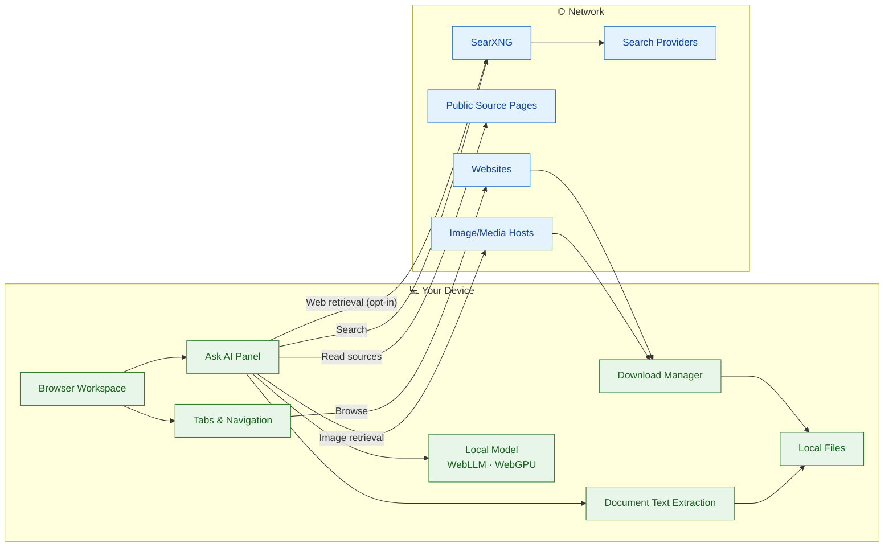
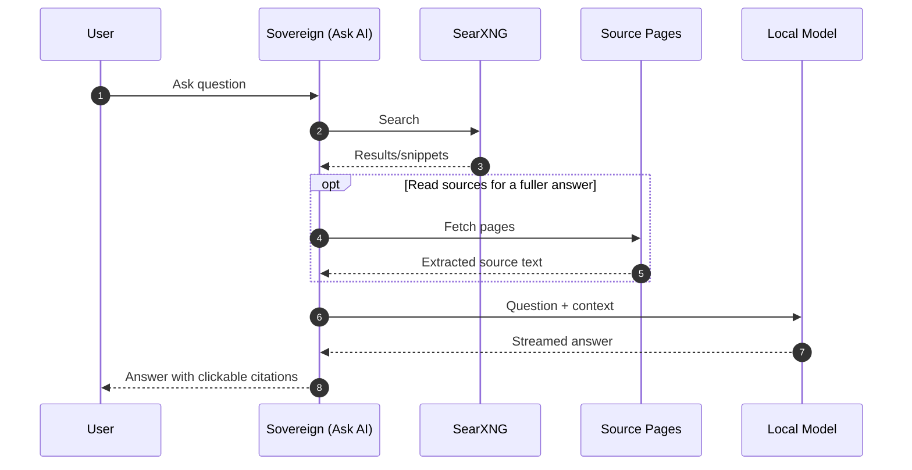

<div align="center">

# Sovereign Browser

**Browse, research, and work with local AI — in one workspace.**


</div>

---

## Overview

Sovereign Browser is a standalone Electron browser prototype built with JavaScript, HTML, CSS, and Electron `WebContentsView`. It combines normal browsing, tabs, local page summaries, web search, downloads, bookmarks, document attachments, media retrieval, and an Ask AI workspace.

AI generation runs on the device through WebLLM after the configured model is downloaded. The network is still used for normal browsing, SearXNG search, optional source-page reading, image/media retrieval, website downloads, and initial model setup.

---

## Table of Contents

- [Features](#features)
- [Architecture](#architecture)
- [Tech Stack](#tech-stack)
- [Getting Started](#getting-started)
- [Usage](#usage)
- [Privacy Model](#privacy-model)
- [Limitations](#limitations)
- [Development](#development)
- [Contributing](#contributing)
- [Project Status](#project-status)
- [Acknowledgments](#acknowledgments)

---

## Features

| Area | Capabilities |
| --- | --- |
| Browsing | `sovereign://newtab` start page · URL and search address bar · Back / Forward / Reload · Tabs · Tab detaching into separate windows · `Cmd+T`, `Cmd+W`, `Cmd+R`, `Cmd+L` · Find in page with `Cmd+F` · Reopen closed tab with `Cmd+Shift+T` · Light/dark theme setting · Optional continue-where-you-left-off startup setting · Sandboxed remote pages with Node.js disabled, context isolation enabled, and `webview` attachment blocked |
| Search & Research | Normal Search page backed by local SearXNG · Ask AI web toggle · Search snippets · Optional source-page reading · Clickable citations · Source-excerpt fallback labels · Search activity visibility · Private-network blocking for source-page fetches |
| Local AI | WebLLM local inference · Default `Llama-3.2-1B-Instruct-q4f16_1-MLC` model · Optional `Llama-3.2-3B-Instruct-q4f16_1-MLC` selector candidate · Automatic background model setup · Model cache reuse · Page Summary sidebar · Ask AI chat with streaming · Follow-up context · Stop, Retry, Copy, New chat · Markdown/PDF answer export |
| Documents & Media | PDF, TXT, Markdown, and CSV attachments · Home-page attachment handoff to Ask AI · PDF.js text extraction worker · Page/section citations for uploaded files · Image/photo/map/video retrieval inside Ask AI · Media cards with source, preview, creator/license metadata when available · Copy original image URL · Download verified direct media files · Website-triggered downloads and blob downloads · Download folder and ask-where-to-save settings · Bookmarks · Editable home shortcuts |

> [!NOTE]
> PDF text extraction supports standard text-based PDFs through PDF.js. Image-only or scanned pages are reported as OCR-required; local OCR is not implemented. Attachment limits are 3 files per chat, PDFs up to 25 MB each, TXT/Markdown/CSV up to 5 MB each, and 60 MB total per chat.

> [!NOTE]
> Media results depend on what SearXNG and source websites return. Thumbnails may not be original-resolution files. Sovereign only enables media download when the target validates as a direct image or video response; thumbnail-only downloads are labeled separately.

---

## Architecture

### System overview



### Research flow



Remote websites run in separate website views. Internal `sovereign://` pages and browser controls communicate with the main process through narrow IPC handlers exposed by `src/preload.js`.

---

## Tech Stack

| Layer | Technology |
| --- | --- |
| Desktop shell | Electron `^38.1.0` |
| UI | HTML, CSS, JavaScript |
| Browser surface | Electron `WebContentsView` |
| Local inference | WebLLM `@mlc-ai/web-llm` with default `Llama-3.2-1B-Instruct-q4f16_1-MLC` |
| Search backend | SearXNG JSON endpoint at `http://127.0.0.1:8080/search` |
| Search service | Docker Compose in `searxng/docker-compose.yml`, bound to `127.0.0.1:8080` |
| PDF parsing | `pdfjs-dist` worker generated by `npm run build:ai` |
| Runtime tooling | Node.js, npm, esbuild |

---

## Getting Started

**Prerequisites**

- macOS with Node.js and npm.
- Docker Desktop or another Docker-compatible runtime for local SearXNG search.
- Electron/WebGPU support for local model inference.
- Disk space for `Llama-3.2-1B-Instruct-q4f16_1-MLC`, about 705 MB for model files plus WebGPU runtime assets.
- The optional `Llama-3.2-3B-Instruct-q4f16_1-MLC` candidate is exposed in Settings but is not downloaded automatically; the code records about 2263.69 MB VRAM required from WebLLM's prebuilt configuration.

### 1. Install and launch

```sh
npm install
npm start
```

`npm start` runs the real package script:

```sh
npm run build:ai
env -u ELECTRON_RUN_AS_NODE electron .
```

### 2. Start the search service

```sh
cd searxng
docker compose up -d
```

Stop it when needed:

```sh
cd searxng
docker compose down
```

### 3. Configure the search endpoint

Use this endpoint in Sovereign Settings:

```text
http://127.0.0.1:8080/search
```

The bundled SearXNG config enables JSON results in `searxng/core-config/settings.yml` and binds the service to localhost only.

> [!IMPORTANT]
> The SearXNG container must be running for Normal Search, Ask AI web retrieval, source reading, and media retrieval to work. Sovereign does not silently use a public SearXNG instance.

---

## Usage

| Goal | How |
| --- | --- |
| Visit a site | Enter a URL in the address bar and press Enter. |
| Search normally | Enter search text in the address bar, click the Search toolbar button, or choose Search on the home page. Normal Search does not load the AI model. |
| Ask locally | Choose Ask AI from the home page or toolbar and ask a question. Answers use the local model after setup. |
| Use web retrieval | In Ask AI, enable **Search the web** or use the inline media search action. Queries go to the configured SearXNG endpoint. |
| Read sources for a fuller answer | From search-backed answers, use the source-reading control to fetch bounded source pages and generate a fuller cited answer. |
| Attach document | Attach PDF, TXT, Markdown, or CSV files in Ask AI, or attach from the home-page search box to hand off into Ask AI. |
| Find image | Ask for an image, photo, map, or video in Ask AI, then click **Search web for images** or **Search web for videos**. |
| Download image | Use **Download** on a media card. **Copy image URL** copies the card's original-image URL; **Download thumbnail** appears only when the original URL is unavailable. |
| Verify citations | Click citation numbers or source cards. Citation mapping means the number resolves to a retrieved source; it is not a guarantee that every model sentence is factually perfect. |
| Manage downloads | Use the toolbar Downloads control or full Downloads page. Completed downloads support Show in Finder and explicit Open. |
| Configure downloads | Settings can ask where to save each file or change the default download folder. By default, website-triggered downloads save automatically with unique filenames. |
| Bookmark pages | Use the address-bar star or `Cmd+D`; manage bookmarks from the Bookmarks page. |
| Use shortcuts | `Cmd+T`, `Cmd+W`, `Cmd+R`, `Cmd+L`, `Cmd+D`, `Cmd+F`, `Cmd+Shift+T`, and Escape for Find in Page are implemented. |

---

## Privacy Model

| Activity | Where it happens |
| --- | --- |
| 🟢 AI generation | Local WebLLM runtime after the model is downloaded and loaded. |
| 🟢 Page summaries | Local extraction from the active tab plus local model generation. |
| 🟢 Document extraction | Local Ask AI renderer/worker path; PDF text extraction uses PDF.js. |
| 🟢 Bookmarks, shortcuts, settings, optional chat history | Local profile data. |
| 🟢 Downloads | Saved locally; Sovereign does not convert local files into public links. |
| 🔵 Model setup | Downloads model/runtime files from the configured model host. |
| 🔵 Normal Search | Sends the query to the configured SearXNG endpoint; SearXNG may contact upstream search engines. |
| 🔵 Source reading | Contacts selected public source pages directly with bounded fetches and no browser cookies or credentials. |
| 🔵 Image/media retrieval | Contacts SearXNG and may load thumbnail/original media URLs from result providers. |
| 🔵 Browsing | Contacts websites normally. |
| 🔵 Website downloads | Contacts the source website and preserves the originating browser session for legitimate authenticated downloads. |

- Sovereign has no silent cloud AI fallback in the current implementation.
- Local inference does not make browsing anonymous; websites, SearXNG, upstream search engines, source pages, image hosts, and download hosts may still receive network requests.

### Privacy Receipt

Sovereign keeps an in-memory privacy receipt for Search and Ask AI activity. The receipt panel shows the last 20 receipts, the contacted hosts, the category of each request, a short "what was sent" summary, and a cloud-AI host check. Receipts can be exported as JSON from the receipt panel.

Receipts record Search queries sent to SearXNG, source-page fetches, image/media retrieval and validation, model/runtime file requests, and other outbound requests from trusted app/AI contexts. Background setup activity, such as startup model downloads, is grouped under a separate **Background** receipt.

Receipts do **not** record normal website browsing tabs, cookies, auth headers, request bodies, browser form contents, page text, prompts, model outputs, or downloaded file contents. Receipts are not saved automatically; they remain in memory until the app exits unless you explicitly export them.

Diagnostic logs are intended to avoid recording queries, page content, credentials, or sensitive URLs, but this is still a development app. Review logs before sharing them.

---

## Limitations

**AI output**

- The default 1B local model is small and can produce incomplete or incorrect answers.
- Citation validation checks whether cited numbers resolve to retrieved sources; it does not prove every claim is correct.
- Real-model answer quality depends on WebGPU availability, model cache state, prompt context, and source quality.
- Chat history is in memory unless Save chats on this device is enabled.

**Retrieval**

- Search requires local SearXNG to be running at the configured endpoint.
- Source reading is bounded by timeouts, size limits, and private-network blocking.
- Some pages cannot be read because of paywalls, logins, scripts, anti-bot defenses, malformed HTML, or site restrictions.
- Live tests depend on upstream services and can be flaky even when the app code is working.

**Media**

- Image and video results depend on SearXNG categories and provider metadata.
- Some providers return thumbnails, watch pages, or source pages rather than direct original media URLs.
- Direct media download is only enabled after main-process validation of redirects and content type.
- Sovereign does not bypass logins, paywalls, DRM, expired links, or access restrictions.
- Media creator/license fields are shown only when providers return usable metadata; otherwise Sovereign displays unknown metadata.

**Documents**

- OCR is not implemented for image-only PDF pages.
- PDF extraction processes up to 300 pages and 200,000 extracted text characters, and marks partial coverage instead of silently truncating.
- Deterministic CSV calculations are limited; do not rely on model guesses for numeric results.

**Application**

- Sovereign is a development prototype, not a production-hardened browser or security product.
- More packaging, signing, source ranking, model diagnostics, long-running test coverage, and distribution decisions remain planned work.

---

## Development

Run syntax and bundled-runtime checks:

```sh
npm run check
```

`npm run check` exists in `package.json` and runs `npm run build:ai`, JavaScript syntax checks for app files, PDF worker checks, and `check:tests`.

**Available scripts**

| Script | Purpose |
| --- | --- |
| `npm run build:ai` | Bundle WebLLM entry code and PDF extraction worker assets. |
| `npm start` | Build runtime assets and launch Electron. |
| `npm run check` | Run app and test syntax checks. |
| `npm run test:electron:model-chat` | Mocked Ask AI chat, follow-up context, formatting, and citation behavior. |
| `npm run test:electron:auto-setup-shutdown` | Automatic model setup startup and shutdown behavior. |
| `npm run test:electron:generation-shutdown` | Shutdown while mocked generation is active. |
| `npm run test:electron:downloads` | Website-triggered and blob downloads with file contents verified on disk. |
| `npm run test:electron:browser-features` | Bookmarks, page summary behavior with mocked model runtime, and tab detaching. |
| `npm run test:electron:ui-smoke` | Chrome, new-tab, Ask AI, and Downloads UI smoke coverage. |
| `npm run test:electron:stage1-usability` | Native edit roles, copy/paste/cut/undo/redo, and shortcut persistence. |
| `npm run test:electron:attachments` | Mocked attachment flow, unsupported files, extraction failures, and citations. |
| `npm run test:electron:home-attachments` | Home-page attachment handoff into Ask AI. |
| `npm run test:electron:pdf-attachments` | PDF.js extraction, page citations, size limits, malformed/password-protected PDFs, and mocked document answers. |
| `npm run test:electron:media-chat` | Mocked media retrieval, card identity, copy/download controls, and video watch-page handling. |
| `npm run test:electron:media-chat-live` | Live localhost SearXNG image retrieval, exact URL copy, opening the image URL, and direct image download. Requires running SearXNG and reachable upstream hosts. |

**Manual checks**

- Test the main user flow manually after UI or IPC changes: new tab, URL navigation, tabs, tab detaching, Search, Ask AI, source reading, downloads, bookmarks, summaries, attachments, and media cards.
- Use isolated test profiles for automated browser tests. Do not run multiple Sovereign instances against the same writable profile.
- Electron may print development-time Content Security Policy warnings for the unpackaged app; review them before distribution.

**Project structure**

```text
src/
  main.js              Electron main process, tabs, downloads, IPC, sessions
  preload.js           Narrow renderer API bridge
  renderer.js          Browser chrome controls
  newtab.*             Sovereign home page
  search.*             Normal search UI
  ask.*                Ask AI chat UI
  sidebar.*            Page summary sidebar
  source-reader.js     Bounded source-page fetching and extraction
  search-backend.js    SearXNG endpoint normalization and retrieval
  downloads.*          Full downloads page
  bookmarks.*          Bookmark management page
  settings.*           Settings UI
  ai/                  WebLLM entry point
tests/electron/        Isolated-profile Electron regression tests
tests/evals/           Manual answer-quality evaluation cases
searxng/               Local SearXNG Docker Compose configuration
```

---

## Contributing

Before opening a PR:

1. Keep changes scoped to the relevant browser, search, AI, document, media, or download path.
2. Preserve security boundaries: do not enable Node.js in remote website pages, and keep context isolation enabled.
3. Treat page text, retrieved snippets, uploaded documents, media metadata, and model output as untrusted data.
4. Prefer extending existing retrieval, source-reading, model, attachment, and download services over adding duplicate pipelines.
5. Run `npm run check`, then manually test the affected user flow with an isolated profile where practical.

For bug reports, include:

- Operating system and hardware.
- Exact reproduction steps.
- Relevant terminal output or app error text.
- Whether SearXNG and the local model were set up.
- Screenshots when useful.
- Remove personal information, page content, credentials, private document text, and sensitive URLs before sharing logs.

---

## Project Status

Sovereign Browser is in active development. It is usable for local testing and iteration, but it is not packaged, signed, or production-hardened.

Implemented work includes browsing, tabs, tab detaching, normal search, Ask AI, local model setup, summaries, source reading, citations, downloads, bookmarks, find in page, document attachments, PDF extraction, and media retrieval/downloads. Planned work includes stronger packaging, broader live-page coverage, better source quality ranking, more model-readiness diagnostics, richer deterministic CSV handling, local OCR, and distribution decisions.

`package.json` currently declares `"license": "MIT"`, but no standalone `LICENSE` file is present in the repository.

---

## Acknowledgments

- [Electron](https://www.electronjs.org/)
- [WebLLM](https://github.com/mlc-ai/web-llm)
- [SearXNG](https://github.com/searxng/searxng)
